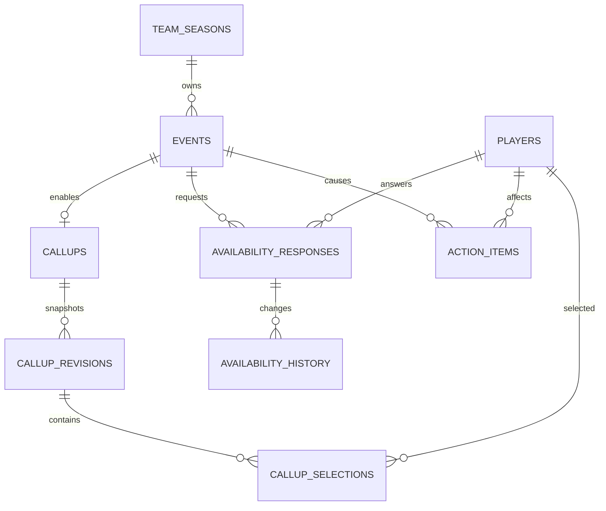

# Relational schema — VS02 delta

## Tables added

- `callups`: one aggregate per Event, status, optimistic version and current revision pointer.
- `callup_draft_selections`: mutable working selection before first publication.
- `callup_revisions`: immutable numbered snapshots with actor, origin and server time.
- `callup_selections`: immutable Player membership per revision.
- `action_items`: explicit human-resolution tasks; partial unique index prevents duplicate OPEN Event+Player+type.

## Events evolved

`events` now has MVP type/capability/logistics fields, actor/timestamps and optimistic `version`. Status is reduced to `ACTIVE | CANCELLED | COMPLETED`. No recurrence tables are introduced.

## Migration discipline

`schema_migrations` makes SQL-first migrations incremental. Existing VS01 databases are adopted without replaying migration 001; fresh databases apply 001 → 002 → 003 transactionally.
