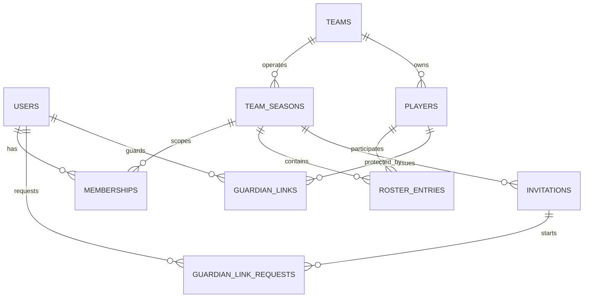

# Relational schema — VS03 delta

## Delta

- `teams.sport`: stable team-level sport; category remains seasonal.
- `team_seasons.created_by_user_id`, `bootstrap_idempotency_key`, `join_code`.
- `roster_entries.creation_idempotency_key`.
- general `guardian_link_requests` may start with nullable `player_id` and store a manual name/optional shirt-number claim.
- partial unique indexes separate individual request deduplication from exact general-claim deduplication, including multiple children per tutor.

The general join code is a locator, not an authorization secret. It is reusable, exact-match only and contains no Player identity.
