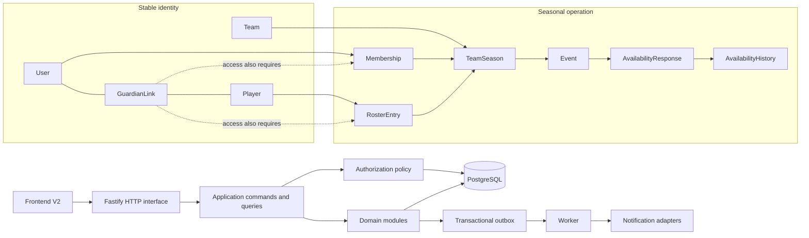

# Talde Hemendik! — Backend Logical Model v1

Estado: **APROBADO Y CONGELADO PARA IMPLEMENTACIÓN INCREMENTAL**  
Fecha: 2026-09-18  
Clasificación: arquitectura; no implica backend implementado.

## 1. Alcance

Modelo lógico para convertir la V2 visual en una aplicación multiusuario real. No autoriza backend, APK ni infraestructura. La V2 sigue siendo referencia funcional, no fuente de verdad ni mecanismo de autorización.

## 2. Arquitectura

Monolito modular con PostgreSQL:

```text
Frontend
  → HTTP interface
    → application commands/queries
      → domain modules + authorization policy
        → PostgreSQL adapters

Domain event → transactional outbox → worker → notification adapters
```

### 2.1 Diagrama lógico consolidado



Módulos:

- IdentityAccess;
- TeamsSeasons;
- Roster;
- GuardianAccess;
- TeamCalendar;
- Availability;
- Callups;
- ActionItems;
- Notices;
- Notifications/Audit.

## 3. Entidades y relaciones

- User tiene muchas Memberships.
- Team es el squad/cohorte permanente; nombre base mutable, identidad interna estable.
- Team tiene muchas TeamSeasons.
- TeamSeason contiene season label, categoría, display label competitivo, configuración y estado.
- Membership relaciona User con TeamSeason y rol `COACH | STAFF | GUARDIAN`.
- Player es perfil mínimo del menor bajo Team; no tiene cuenta.
- RosterEntry relaciona Player con TeamSeason y guarda dorsal/posición/estado estacional.
- GuardianLink relaciona históricamente User tutor con Player.
- Event pertenece a TeamSeason y puede habilitar Availability, Callup y/o Attendance.
- AvailabilityResponse es el estado vigente Event+Player; NO_RESPONSE se deriva por ausencia.
- Callup pertenece a Event y tiene CallupEntries independientes de Availability.
- Notice es comunicación operativa con audiencia snapshot.
- ActionItem representa una acción humana persistente; otros indicadores se calculan.

## 4. Invariantes v1

1. User no tiene rol global.
2. Membership pertenece a TeamSeason.
3. Team no equivale a categoría anual.
4. Acceso GUARDIAN a Player requiere Membership activa + GuardianLink activo + RosterEntry activa en la misma TeamSeason.
5. Una temporada nueva crea Memberships nuevas; rollover siempre explícito.
6. Invitation no concede acceso.
7. Resolver Invitation antes de auth no revela PII del Player.
8. Nunca se enumera plantilla para solicitar vínculo.
9. Sólo COACH aprueba/rechaza/revoca GuardianLinks en MVP.
10. Birth date no pertenece al MVP ni identifica al menor.
11. Availability y Callup son agregados distintos.
12. NO_RESPONSE es ausencia de respuesta.
13. Última Availability válida es vigente; el historial es append-only.
14. `CANNOT_ATTEND` no puede añadirse a Callup vigente.
15. `UNSURE/NO_RESPONSE` requiere warning + confirmación explícita para Callup.
16. Cambiar Availability no sustituye automáticamente a un convocado.
17. Sólo COACH/STAFF decide sustituciones.
18. Un cambio puntual de recurrencia no reescribe la serie ni el histórico.
19. Frontend nunca decide autorización ni confirma entrega externa.
20. Toda mutación sensible usa transacción, control optimista e idempotencia cuando pueda reintentarse.

## 5. Flujos definitivos de invitación

### 5.1 Invitación individual — vía principal

1. COACH abre Player y elige “Invitar familia”.
2. Backend crea Invitation con TeamSeason + Player + propósito, token aleatorio, hash, expiry.
3. Antes de auth se muestra sólo Team/season metadata pública.
4. Tutor introduce email y OTP.
5. AuthAdapter resuelve/crea User.
6. Tutor confirma que solicita el vínculo asociado.
7. Backend crea GuardianLinkRequest `PENDING`; todavía no hay acceso.
8. COACH aprueba o rechaza.
9. Aprobar crea/activa Membership GUARDIAN y GuardianLink en transacción.
10. Policy exige además RosterEntry activa para autorizar datos del Player.

### 5.2 Invitación general — fallback

1. COACH crea Invitation de TeamSeason sin Player.
2. Tutor se autentica por OTP.
3. Introduce manualmente nombre y dorsal opcional.
4. No hay lista, autocomplete, sugerencias ni coincidencias parciales.
5. Se crea GuardianLinkRequest `PENDING` con claim textual.
6. COACH identifica el Player y aprueba o rechaza.

## 6. Estados

```text
Membership: ACTIVE | SUSPENDED | REVOKED
GuardianLinkRequest: PENDING | APPROVED | REJECTED | CANCELLED
GuardianLink: ACTIVE | REVOKED
TeamSeason: DRAFT | ACTIVE | ARCHIVED
Event: DRAFT | PUBLISHED | CANCELLED | COMPLETED
AvailabilityResponse: CAN_ATTEND | CANNOT_ATTEND | UNSURE
Callup: DRAFT | PUBLISHED | CANCELLED
CallupEntry: SELECTED | WITHDRAWN
Notice: DRAFT | PUBLISHED | CANCELLED
ActionItem: OPEN | RESOLVED | DISMISSED | AUTO_RESOLVED
```

## 7. Disponibilidad y convocatoria

Tutor autorizado, COACH o STAFF pueden registrar Availability mientras esté abierta. Para registro delegado se guarda actor, timestamp servidor, `source=STAFF_RECORDED` y nota breve opcional. El tutor puede modificar después; control optimista evita sobrescritura silenciosa entre dos tutores.

Al preparar/publicar Callup:

- CAN_ATTEND: elegible;
- UNSURE/NO_RESPONSE: elegible con warning y confirmación explícita;
- CANNOT_ATTEND: no elegible; primero debe cambiar Availability por flujo autorizado.

Si un SELECTED pasa a CANNOT_ATTEND:

- se emite `PlayerAvailabilityChanged`;
- se crea ActionItem deduplicado `CALLED_UP_PLAYER_UNAVAILABLE`;
- Callup permanece sin mutación automática y muestra conflicto;
- se listan CAN_ATTEND no seleccionados;
- COACH/STAFF retira, sustituye o mantiene pendiente;
- sustituir es una transacción con revisión de Callup, resolución del ActionItem, auditoría y outbox.

## 8. “Pendiente de ti”

Calculado:

- familias sin responder;
- deadline próximo;
- Callup lista para preparar;
- contadores de onboarding.

Persistido como ActionItem:

- GuardianLinkRequest pendiente;
- convocado ahora no disponible;
- cambio de Event que requiere Notice;
- fallo de entrega que requiere intervención.

No se crea motor de workflow.

## 9. Matriz final de permisos

| Acción | COACH | STAFF | GUARDIAN |
|---|---:|---:|---:|
| Ver TeamSeason/agenda general permitida | Sí | Sí | Sí |
| Cambiar Team/TeamSeason estructural | Sí | No | No |
| Crear/cerrar temporada o eliminar Team | Sí | No | No |
| Gestionar Memberships/staff | Sí | No | No |
| Aprobar/rechazar/revocar GuardianLink | Sí | No | No |
| Crear/modificar/cancelar Events | Sí | Sí | No |
| Ver plantilla completa/datos operativos necesarios | Sí | Sí | No |
| Gestionar Player/RosterEntry operativo | Sí | No; sólo consulta | No |
| Consultar Availability completa | Sí | Sí | No |
| Registrar Availability delegada | Sí | Sí | No |
| Responder Availability de hijos | No como tutor | No como tutor | Sí, vinculados |
| Crear/modificar/publicar Callup | Sí | Sí | No |
| Gestionar sustituciones | Sí | Sí | No |
| Publicar Notices operativos | Sí | Sí | No |
| Ver Notice | Según audiencia | Según audiencia | Según audiencia |
| Ver datos/Availability/Callup propios hijos | Sí | Sí | Sí |
| Ver PII/Availability de otras familias | Sí, necesidad operativa | Sí, necesidad operativa | No |

STAFF usa un rol fijo MVP. Capacidades finas quedan preparadas conceptualmente pero no implementadas.

## 10. Visibilidad GUARDIAN

Puede ver:

- información pública/general del equipo;
- agenda permitida;
- logística de Events;
- Notices de su audiencia;
- información operativa, Availability y estado de Callup de sus hijos.

No puede ver:

- teléfonos o vínculos de otras familias;
- PII o Availability de otros Players;
- plantilla completa con PII;
- lista completa de convocados en MVP.

## 11. Tablas MVP

`users`, `clubs` opcional, `teams`, `team_seasons`, `memberships`, `players`, `roster_entries`, `invitations`, `guardian_link_requests`, `guardian_links`, `event_series`, `events`, `availability_responses`, `availability_history`, `callups`, `callup_entries`, `attendance_records`, `action_items`, `notices`, `notice_recipients`, `outbox_events`, `audit_events`.

Constraints mínimas:

- FK completas;
- unique Event+Player en Availability;
- unique Event en Callup;
- version en agregados mutables;
- índices TeamSeason+estado+fecha;
- hash de Invitation token;
- no cascadas destructivas sobre historial;
- RLS defensiva más policy backend obligatoria.

## 12. Autenticación

Email OTP de seis dígitos detrás de AuthAdapter.

- COACH: entrada específica → OTP → User → Team/TeamSeason/Membership COACH.
- GUARDIAN: Invitation válida → OTP → User → GuardianLinkRequest.
- Sin Invitation, un tutor nuevo no explora Teams.
- User existente accede a Memberships existentes.
- Dominio no conoce proveedor concreto.

## 13. Retención

**Engineering retention baseline — legal review required before live pilot.**

- notas libres Availability: 30 días tras Event;
- Invitations expiradas/revocadas y requests rechazadas/canceladas: 90 días;
- datos operativos: TeamSeason + 12 meses;
- auditoría crítica: 12 meses;
- después, borrar o anonimizar PII preservando integridad técnica necesaria.

No es política legal definitiva.

## 14. Decisiones abiertas no bloqueantes

1. Detalle de recurrencia “esta / futuras”.
2. Auto-revocación de GuardianLink por GUARDIAN.
3. Acuse explícito de Callup separado de Notice leído.
4. Reglas detalladas de cancelación/comunicación de Event.
5. Región/proveedor y RPO/RTO antes de infraestructura.
6. Proveedores concretos de auth/email/push detrás de adapters.
7. Configuración futura para publicar listas de convocados.

## 15. ADRs

- [ADR-0001](../adr/0001-team-teamseason-membership.md)
- [ADR-0002](../adr/0002-guardian-invitations-and-links.md)
- [ADR-0003](../adr/0003-mvp-role-permissions.md)
- [ADR-0004](../adr/0004-callup-eligibility-and-confirmation.md)
- [ADR-0005](../adr/0005-delegated-availability.md)
- [ADR-0006](../adr/0006-guardian-visibility-and-player-minimization.md)
- [ADR-0007](../adr/0007-engineering-retention-baseline.md)
- [ADR-0008](../adr/0008-email-otp-authentication.md)
